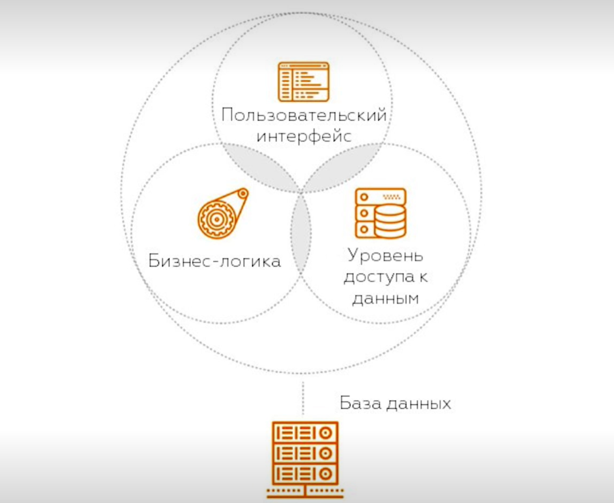
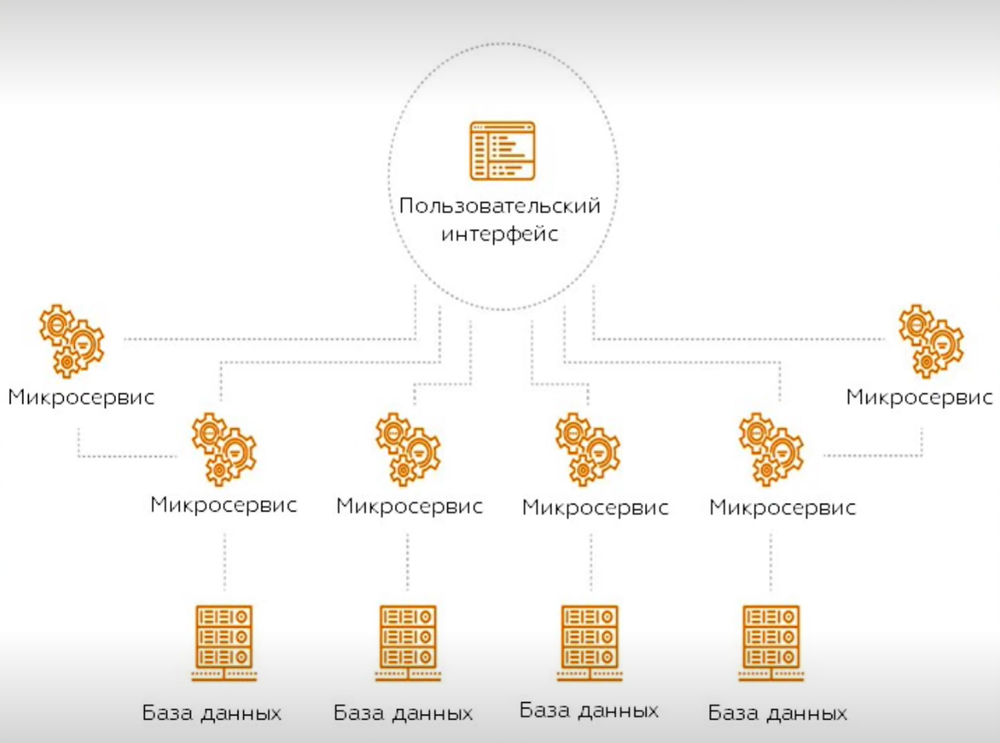
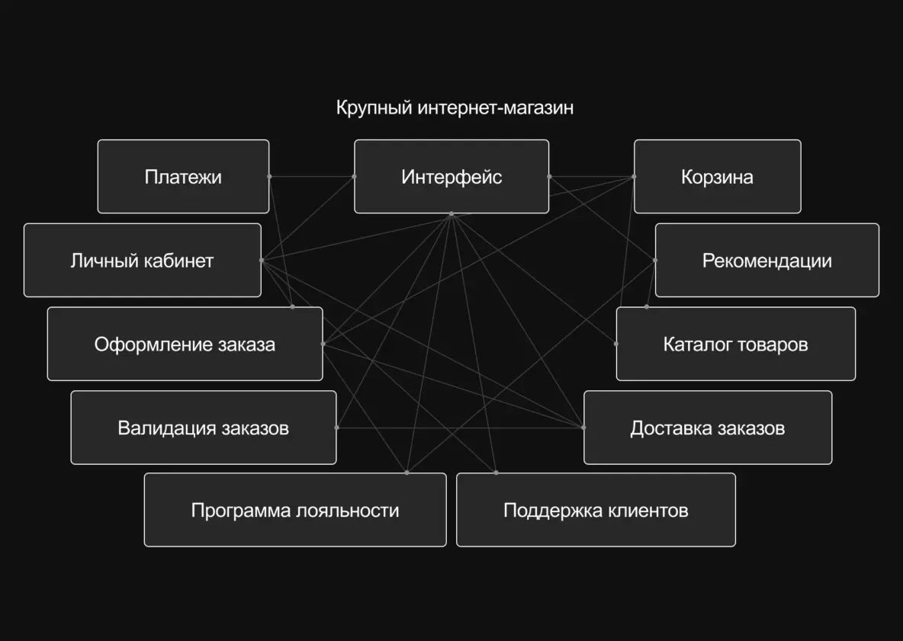

# Задание 5
# Монолит vs Микросервисы: разбираем архитектуры на примере интернет-магазина
При разработке программного обеспечения важно не только написать код, но и правильно организовать структуру всей системы. Эта структура называется **архитектурой приложения** — она определяет, из каких компонентов состоит программа и как они взаимодействуют друг с другом.

От выбранной архитектуры зависит, насколько легко систему будет развивать, масштабировать и поддерживать в будущем.

Одними из самых распространённых подходов являются **монолитная архитектура** и **микросервисная архитектура**. 
В этой статье мы рассмотрим различия между этими подходами на примере **интернет-магазина**, а также разберём их преимущества, недостатки и области применения.

## **Монолитная архитектура**
**Монолитная архитектура** — подход, при котором вся функциональность и компоненты приложения находятся внутри одного единого и неразделимого блока (монолита).

Рассмотрим небольшой интернет-магазин. В приложении есть:
-   интерфейс, через который пользователи взаимодействуют с сервисом;

-   каталог товаров;

-   корзина;

-   оформление заказов;

-   оплата;

-   пользовательские профили;

-   база данных.

В монолите все эти части связаны друг с другом. Если, например, нужно изменить работу корзины, придется **обновлять и тестировать всё приложение**. Это происходит потому, что все модули системы находятся в одном кодовом проекте и развёртываются как единое приложение.ы

#### Преимущества и недостатки

---

| Преимущества                 | Недостатки                   |
|------------------------------|------------------------------|
| простота разработки          | масштабируемость             |
| единое развертывание         | усложнение поддержки         |
| целостное тестирование       | низкая гибкость              |
| производительность           | риски надежности             |

#### Когда использовать? 
---
* Небольшая команда разработчиков, которая может эффективно управлять кодовой базой
* Приложение не предполагает значительного роста или сложных функций
* Когда скорость вывода продукта на рынок важнее его гибкости

## **Микросервисная архитектура**
Микросервисная архитектура - подход, при котором приложение разделяется на множество независимых сервисов, каждый из которых выполняет свою задачу. Каждый сервис может проходить этапы разработки, внедрения, расширения вне зависимости от других.

Возьмем тот же интернет-магазин. Крупные интернет-магазины, например «Озон». Такие приложения могут состоять из множества микросервисов. Вот некоторые из них:

-   интерфейс;
-   платежи;
-   доставка заказов;
-   программа лояльности;
-   валидация заказов;
-   каталог товаров;
-   рекомендации;
-   корзина;
-   личный кабинет;
-   поддержка клиентов.

Каждый сервис развивается и масштабируется **независимо**. Если нагрузка на каталог растет, можно масштабировать или обновить только его, не трогая остальные сервисы.

#### Преимущества и недостатки
---

| Преимущества                      | Недостатки                     |
|-----------------------------------|-------------------------------|
| масштабируемость                  | сложность управления          |
| гибкость в разработке             | сложность тестирования       |
| гибкость в развертывании          | повышенные сетевые затраты    |
| устойчивость к сбоям              | требования к инфраструктуре   |
| облегчение управления большими командами |                               |

#### Когда использовать?
---

* Система большая и сложная, когда система имеет много независимых бизнес функций и требует масштабируемости.

* Приложение регулярно обновляется

* Разные технологии для разных частей системы

## **Сравнение**
| Характеристика | Монолит | Микросервисы |
| :--- | :--- | :--- |
| **Код** | единое приложение | набор сервисов |
| **Ошибка в модуле** | Останавливает всё приложение | Влияет только на один сервис |
| **Обновление** | Перезапуск всего приложения | Обновление только нужного сервиса |
| **Масштабирование** | Только целиком  | Можно масштабировать отдельные компоненты |
| **Гибкость в выборе технологий** | Ограничен  | Высокий |
| **Подходит для** | Маленькие проекты, MVP   | Большие системы, команды  |

Монолитная архитектура проще в разработке и хорошо подходит для небольших проектов и MVP.
Микросервисная архитектура сложнее в реализации, но обеспечивает большую гибкость, масштабируемость и удобство работы больших команд